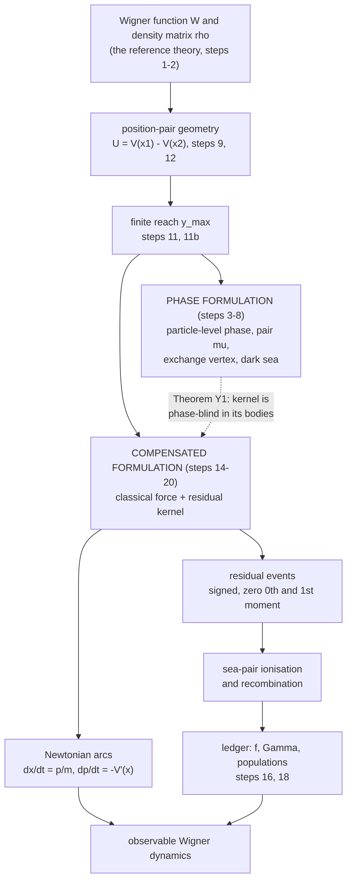

# Orientation

**A conceptual guide to WPMW for a reader arriving with no prior context:
what the project is trying to do, what the one central idea is, which words
mean what, and what is established as against postulated, open, or
retracted.**

---

## 0. Status and provenance

Written 20 September 2026 against the repository at commit `c4443e0`
(ladder steps 1–20, including 11b).

Prompted by an external summary of the repository produced by a different
language model at Bill Page's request, as a check on whether the project
reads correctly from outside. Most of it did. The places where it did not
are the places this document works hardest, and they are listed in §10 —
they are the errors a careful outside reader is most likely to make, so
they are worth stating as warnings rather than silently correcting.

This document carries **no new results**. Every claim here is sourced to a
note in [`docs/analysis/`](docs/analysis/README.md), and where a claim is
load-bearing the theorem label is given so it can be looked up in
[`docs/analysis/INDEX.md`](docs/analysis/INDEX.md). Where this document and
a note disagree, the note is right.

It is also not a replacement for [`docs/README.md`](docs/README.md), which
says what is in each directory, or for the ladder in
[`docs/analysis/README.md`](docs/analysis/README.md), which is the
step-by-step abstract of the argument. This is the layer below both: the
picture you need in order to read those without misreading them.

---

## 1. What the project is trying to do

Quantum mechanics is normally written as a wave equation. WPMW asks a
narrower question than "is that the right picture": it asks whether the
*same* dynamics can be carried by a population of ordinary point objects
moving on ordinary Newtonian trajectories, provided the population is
allowed to be **signed** — some members counting $`+1`$ and some $`-1`$ —
and provided members can be created and destroyed.

The objects are called **world-particles** or **worlds**. They live in
phase space: each one has a position and a momentum at once, which is the
first thing that distinguishes this from a Bohmian or many-interacting-worlds
picture, where a world carries a position and the momentum is derived from a
field.

The reference theory the construction is tested against is the **Wigner
function** $`W(x,p)`$ and its equation of motion, the quantum Liouville
equation (QLE). Nothing in this project claims to have eliminated the
wavefunction or the density matrix from the mathematics. $`W`$ and
$`\rho`$ are what every result is checked against; the question is whether
a signed particle ensemble can *carry* them, and what that ensemble has to
be like if it can.

The working slogan is:

> **no new force, but new kinematics.**

That slogan is itself a correction — an earlier version said "no new
physics," which [`compensated_ontology.md`](docs/analysis/compensated_ontology.md)
§0 shows was too strong. §4 below says why.

---

## 2. The one central idea: the compensated split

This is the whole of it, and everything else in the repository is either
what led to it or what it costs.

Write the Wigner equation with the potential term moved to the right:

```math
\partial_t W \;+\; \frac{p}{m}\,\partial_x W \;-\; V'(x)\,\partial_p W
\;=\; \mathcal{R}[W] .
```

The left side is *exactly* classical Liouville transport — streaming plus
the full classical force. The right side, $`\mathcal{R}`$, is whatever is
left over. The claim is that this is not a perturbative split but a clean
one, and that the two halves have genuinely different characters:

- the classical half is realised by letting every world-particle move on a
  Newtonian arc, $`\dot x = p/m`$, $`\dot p = -V'(x)`$ — deterministic,
  continuous, no quantum force anywhere in it;
- the residual half is realised by **events** that change *which* signed
  carriers exist, not how any existing one accelerates.

Where the split comes from is worth seeing, because it is a two-line
calculation and it explains the vocabulary. In the variable $`s`$ conjugate
to momentum, the entire potential term of the QLE is multiplication by

```math
M(x,s) \;=\; \frac{i}{\hbar}\bigl[\,V(x+y) - V(x-y)\,\bigr],
\qquad y = \frac{\hbar s}{2} .
```

So a world at $`x`$ does not consult $`V`$ at a point. It consults the
*difference* of $`V`$ at two places symmetric about $`x`$, separated by
$`2y`$. Expand in $`y`$: the term linear in $`y`$ is exactly
$`-V'(x)\,\partial_p`$, the full classical force. Subtract it. What remains
is the odd part of the cubic Taylor remainder of $`V`$ — Theorems C1 and C2
of [`compensated_liouville_splitting.md`](docs/analysis/compensated_liouville_splitting.md).

**Theorem C3** is the reason the split is worth making. Restricted to a
bounded separation, the residual kernel has zero zeroth *and* first
moments. So the residual channel:

- conserves signed world number;
- carries no net momentum;
- exerts no force;
- contains the entire non-classical content.

Two immediate consequences that a reader should hold onto:

- For a **quadratic** potential the residual is identically zero — measured
  at $`1.2\times10^{-15}`$ at every reach (Theorem G2). The harmonic
  oscillator is exactly classical in this formulation, *and it is still
  quantum*. The residual channel is switched on by the non-linearity of
  $`V`$ in the separation, not by "quantumness."
- For a free particle the coupling vanishes identically (Proposition I1).
  So free wave-packet spreading is **not** an interworld force here — which
  is the sharpest point of difference from many-interacting-worlds models,
  where the interworld potential is precisely what makes a free packet
  spread.

---

## 3. What the residual events actually are

The residual kernel is real and odd, hence **signed**, hence not a
one-body Markov jump generator — it cannot be realised as "this particle
hops with this probability" (splitting note §2.2, and Proposition T3 in
[`takabayasi_1954_stochastic_picture.md`](docs/supplement/takabayasi_1954_stochastic_picture.md)).
Something has to supply the negative part.

That something is the **sea**: a background population of neutral
positon–negaton pairs. A residual event **ionises** a sea pair — splits it
so that its two members become separately visible at two momentum rungs —
and the reverse event, **recombination**, closes one back up. Momentum
conservation forces the consumed pair to sit on the parent's own row
(Theorem S0), which is what makes "ionisation" a derivation rather than a
metaphor.

Two things about the sea that are easy to get wrong:

1. **It is not optional bookkeeping.** Step 2's no-go lemma shows pairwise
   collision rates among tracked particles are quadratic in occupancy while
   the QLE generator is linear, so a collision-based microdynamics needs a
   species whose density is pinned. Step 10 (Propositions B1, B2) shows that
   once $`N>1`$ the sea is the *only* available collision partner.
2. **Pairs are not created and destroyed by the four actions — they are
   split and combined** (Theorem D15). Positon number and negaton number are
   each separately conserved by those actions.

---

## 4. What compensation does *not* remove

This is the single most important qualification in the project, and the
place where an outside summary is most likely to overclaim.

Removing the classical force from the quantum channel removes **quantum
force**. It does not remove **quantum kinematics**.

The evidence is Theorem G4, and it was not anticipated. Take an admissible
ensemble — one whose expectation is the Wigner function of some
$`\rho \ge 0`$ — and evolve it by streaming alone, i.e. by postulate (S)
with the residual channel switched off. It leaves the admissible set: the
least eigenvalue of the reconstructed $`\rho`$ falls from the $`10^{-8}`$
grid floor to $`-0.10`$. Turn the residual channel back on and it does not.

So the residual channel is doing **kinematic** work — keeping the ensemble
inside the allowed quantum state space — and not merely supplying a small
correction to observable forces. The sea is load-bearing for the *state
space*, not just for the *dynamics*.

Theorem G3 makes the same point from the other side: the residual generator
and the admissibility constraint are independent functions of $`\hbar`$. A
quartic sweep closes the first continuously while the second does not move
at all. Proposition G3.1 exhibits four Gaussians the dynamics cannot tell
apart, differing by a factor of eight in phase-space area; the inequality
that separates them is exactly the Wigner bound $`|W| \le 2/h`$.

This is why admissibility is a **separate postulate** (A) and not a
theorem. See §6.

---

## 5. The reach

The reach is the one parameter the whole construction depends on, and it is
also the one most often misdescribed.

**What it is.** The **coherence horizon** $`L_c`$ bounds the ket–bra
separation a world instantiates; the **reach** is the half-separation,
$`y_{\max} = L_c/2`$ (Definitions (H) and (R),
[`open_position_space.md`](docs/analysis/open_position_space.md) §3). It is
a bound in the *separation* coordinate, not a wall in position space — it
is orthogonal to position.

**What it is not.** It is not an aperture through which a world samples
nearby positions. **Theorem E1**: a momentum lattice exists *if and only if*
the difference field $`D_x(y) = V(x+y) - V(x-y)`$ is periodic in $`y`$, with

```math
\Delta p \;=\; \frac{\pi\hbar}{\text{period}} ,
```

and the ring circumference, the periodicity of $`V`$, and the postulated
horizon are one mechanism with three sources for that period. A window of
finite support does not by itself deliver a lattice. Proposition E1.1
sharpens this: a sharp window is exact when $`2y_{\max}`$ is a whole number
of periods of the potential and fails otherwise — **commensuration**, not
sharpness, is what matters. When the horizon does supply the period,
$`\Delta p = \pi\hbar/(2y_{\max})`$ (Theorem C4), so reach and momentum
quantum are the same parameter seen twice.

**What it controls.** Simultaneously: the greatest pair separation a world
represents; the momentum resolution; the position range over which a world
feels a scatterer (Theorem C7 — if $`V'''`$ vanishes on
$`[x-y_{\max},\,x+y_{\max}]`$, a world at $`x`$ takes no events at all);
and the event budget of the residual channel.

**Its ceiling is set by the potential.** Theorem K1: the reach ceiling is
the distance to the nearest *complex* singularity of $`V`$. For the Eckart
barrier $`V_0\,\mathrm{sech}^2(r/a)`$ this is the uniform bound
$`y_{\max} < \pi a/2`$. For a soft-core Coulomb potential it is
$`R(x) = \sqrt{x^2 + \varepsilon^2}`$, which *varies with position* — so
either the momentum quantum varies with $`x`$ and the phase-space crystal
is not uniform, or a single uniform lattice must take the infimum
(Theorem Z3). This is open item Z-LS1.

**It is a regulator, and that is a defect, not a feature.** Theorem E8: the
residual event budget grows without bound with the reach for every $`V`$
with $`V'(x) \ne 0`$. Theorem G5: $`\Gamma`$ grows roughly linearly with
the reach while the generator converges to $`10^{-14}`$. So *how many
worlds exist* is currently a property of the regulator rather than of the
physics. Whether that matters is exactly open item **G-SP1** (split gauge
invariance), the load-bearing open question of the ontology note.

A tutorial written for exactly this confusion is
[`what_the_reach_is.md`](docs/supplement/what_the_reach_is.md). Read it
before reading anything that quotes a reach.

---

## 6. The proposed ontology

Stated as four postulates in
[`compensated_ontology.md`](docs/analysis/compensated_ontology.md):

| | Postulate | Content |
|---|---|---|
| **(E)** | Existence | A world is a signed counting measure on phase space. |
| **(A)** | Admissibility | Only ensembles whose expectation is the Wigner function of some $`\rho \ge 0`$ occur. |
| **(S)** | Streaming | Every world-particle streams on a Newtonian arc under the *full* classical force. Co-located members of a sea pair share a trajectory. |
| **(D)** | Demography | Pairs are ionised from and recombined into the sea at rate $`\Gamma = \sum_q |K_{\mathrm{res}}|`$, with absorptive fraction $`f`$. |

(A) is **not** derivable from (S) + (D) — that is Proposition G3.1 and
Theorem G4. It is non-dynamical: it constrains which ensembles occur, not
how they move. Giving it a particle-level statement is open item G-SP2.

---

## 7. The ledger, and why it is invisible

The observable map takes the signed ensemble to $`W`$. If $`u_+`$ and
$`u_-`$ are the positive and negative populations, then

```math
W \;\propto\; u_+ - u_- ,
```

and the QLE says **nothing at all** about $`u_+ + u_-`$. The total
population is extra structure, not readable off the reference theory. This
is why "how big is the sea" is a real question with no answer in the Wigner
equation.

Every residual event has two realisations that agree in the observable and
disagree in the ledger:

- **emissive** — add the appropriate signed carrier;
- **absorptive** — remove the opposite one.

Theorem N2: both move the observable identically, so the choice between
them lies entirely in the kernel of the observable map. The only noise
$`W`$ ever sees is Poisson event-timing noise, common to both branches.

Write $`f`$ for the absorptive fraction. **Theorem N3** is the current law:

```math
\Gamma_{\mathrm{tot}}\,(1 - 2f) \;=\; R_{\mathrm{sink}} ,
```

where $`R_{\mathrm{sink}}`$ is the total rate of every *other*
body-removing channel. So:

- $`f = 1/2`$ is the **sinkless special case**, not a universal law — this
  is an explicit correction to the earlier Theorem S7;
- any sink forces $`f < 1/2`$ by a computable amount, verified to between
  0.01 and 0.9 per cent over a fortyfold range;
- population closure is a dynamical problem in its own right.

Under an independent-occupancy closure $`f(\lambda) = (1-e^{-\lambda})^2`$,
and the sinkless value pins
$`\lambda_* = -\ln(1 - 2^{-1/2}) = 1.227947`$ bodies per species per cell —
2.456 bodies per cell against exactly two sea pairs per Planck cell,
measured 2.4487 against 2.4559 in the well-mixed limit (Theorems N4, N5).

**Theorem N6** reassigns a role the project had wrongly given to
recombination: with transport off, per-cell occupancy is a reflected
critical random walk whose spread grows without bound; turning streaming on
holds it flat. **Streaming, not recombination, is the local regulator** —
and by N3 no sink could have been, since every sink moves $`f`$ off one
half.

---

## 8. The vocabulary, including the trap

### 8.1 Dictionary

| Term | Mathematical role | What it means |
|---|---|---|
| **World / world-particle** | a signed atom of a counting measure on $`(x,p)`$ | one carrier; has a position *and* a momentum |
| **Positon / negaton** | sign of the carrier (ensemble E1), or ket/bra leg (ensemble E2) | **two different meanings** — see §8.3 |
| **Leg** | one end of a ket–bra pair, carrying "a place and a clock" | the two positions $`x \pm y`$ are two *branches'* answers to where one body is, not two bodies |
| **Reach $`y_{\max}`$** | $`y_{\max} = L_c/2`$; period giving $`\Delta p = \pi\hbar/2y_{\max}`$ | greatest half ket–bra separation instantiated |
| **Sea pair** | background neutral pair population | the partner population residual events consume and return |
| **Dark / aligned** | $`\mu = 0`$ | a *relational* state of a pair, not a species |
| **Residual channel** | compensated odd kernel $`\mathcal{R}`$ | what is left of the QLE after the classical force is removed |
| **Ionisation** | sea pair $`\to`$ two visible daughters | the microscopic realisation of a residual event |
| **Recombination** | two carriers $`\to`$ sea pair | ledger closure |
| **Admissibility** | $`\rho \ge 0`$ after reconstruction | the constraint (A) selecting physical ensembles |
| **$`\mathcal{E}`$ (the observable map)** | ensemble $`\to`$ $`W`$ | what is measurable; the ledger lives in its kernel |

### 8.2 The two $`\mu`$ — the trap

There are **two distinct quantities written $`\mu`$** in this repository,
and conflating them produces a picture that looks coherent and is wrong.

| | **Pair $`\mu`$** (step 5) | **Ladder $`\mu`$** (step 9) |
|---|---|---|
| Definition | $`\mu = \Phi_a - \Phi_b \pmod{2\pi}`$, the misalignment of two transported clock phases | $`\mu = \arg\rho(X,X')`$ |
| Lives in | the phase-resonance / phase-alignment formulation | the position-pair ladder |
| Obeys | $`\partial_x\mu = \Delta p/\hbar`$; $`d\mu/dt = \Delta p(v - \bar v_{\mathrm{pair}})/\hbar`$ | $`\bar p = \hbar\mu/a`$ — momentum *is* the misalignment |
| Conjugate to | — | the separation $`y`$ the compensated kernel integrates over |

[`what_the_reach_is.md`](docs/supplement/what_the_reach_is.md) §1 exists
specifically to keep these apart. If a summary runs
"reach $`\to \Delta p \to \mu`$-winding $`\to`$ dark sea $`\to`$ residual
ionisation" as one chain, it has crossed between the two.

### 8.3 Other collisions

- **Positon** means the sign of $`W`$ in ensemble E1 and the ket leg in
  ensemble E2. **Theorem D0**: the Weyl transform relates the represented
  objects but *not* the ensembles — the species censuses are anti-correlated
  and no carrier-level map exists. The word is a homonym across the two
  layers.
- **"Bound"** is deprecated for a sea pair. A sea pair's darkness is a
  phase relation, not a binding; open item Y-SP8 proposes "aligned."
- **"Sea"** describes what a pair is doing in the population dynamics;
  **"dark"** describes its internal phase relation. A dark sea pair is
  both; neither word implies the other.

---

## 9. How the layers relate

The repository is not one model. It is a **ladder** of formulations, each
taking as input something its predecessor postulated. Read as a single
model it will look inconsistent, because later rungs retract earlier ones —
by design, and each note's §0 says what it retracts.

Two distinct formulations coexist, and this is the point most easily missed:



The dotted arrow is the one that matters. **Theorem Y1**: the compensated
kernel is read from the potential directly — $`K(\lambda V) = \lambda K(V)`$
to machine precision — so the phase-blind no-go of step 4 (Theorem 2) does
not reach it, and the phase it needs is *already integrated into the
kernel* as the ladder $`\mu`$. **Corollary Y1.1**: a particle-level phase
can therefore never be *necessary* for the observable $`\mathcal{E}`$; any
phase rule lives in the kernel of the observable map, where the emissive /
absorptive choice already lives.

So the phase machinery of steps 3–8 is **not an upstream input** to the
compensated model. It is a parallel formulation, and a source of
interpretive vocabulary, whose particle-level phase the compensated model
does not require. Summaries that chain the phase layer into the compensated
layer as a dependency are describing a model the repository does not have.

---

## 10. What is established, what is open, and what has been retracted

### 10.1 The strongest positive results

| Result | What it shows |
|---|---|
| **Eckart transmission (K4–K6)** | The classical outcome functional is exactly invariant under streaming plus deterministic acceleration, so the *entire* quantum correction to transmission is delivered by the residual channel: 0.044475 measured against a closed-form 0.044134. It arrives as a small imbalance between two large opposed flows of pairs across the classical separatrix, net/gross $`= 0.19`$. |
| **Quadratic emptiness (G2)** | $`1.2\times10^{-15}`$ at every reach, against $`O(100)`$ for the published field-less signed-particle formulation on the same system. The sharpest available argument that the compensated split is ontology and not numerics. |
| **Kinematic work (G4)** | Admissibility is preserved by (S)+(D) and not by (S) alone. |
| **Pathwise invariant (N1)** | $`P = S + N/2`$ is conserved in exact integers on every trajectory, not merely in expectation. |
| **Transport as regulator (N6)** | Streaming, not recombination, holds the local ledger steady. |

### 10.2 Retracted or corrected — do not repeat these

These were stated in the repository and are no longer the project's
position. [`INDEX.md`](docs/analysis/INDEX.md) §6 is the full ledger; these
are the ones an outside reader is most likely to have picked up.

| Retracted claim | Replaced by |
|---|---|
| "No new physics" | "No new force": (A) is non-dynamical and not derivable from (S)+(D). |
| $`f = 1/2`$ is a universal law (S7) | $`\Gamma_{\mathrm{tot}}(1-2f) = R_{\mathrm{sink}}`$ (N3); $`f = 1/2`$ is the sinkless case. |
| The worldlines need not break — the transported phase is continuous | **Theorem Y5**: if worlds are conserved and none ever changes momentum at an event, per-row species counts are event-invariant and the residual channel can do nothing. The two-clock reading *forces* piecewise worldlines; the alternative is birth and death. There is no third option. |
| "The diffusion in the phase variables is identically zero" | **Theorem Y6**: holds under birth and death; a *tagged* positon's momentum walk is driftless with diffusion $`D_p = \tfrac12\sum_q \xi_q^2\,|K_q|`$ — an unsigned moment the observable never feels. |
| Tunnelling is a population effect superposed on continuous individual trajectories | **Theorem Y6**: measured tagged-positon crossing is 0.327 against 0.213 for the observable and 0.069 classically at $`E_0 = V_0/2`$, tracking neither, and falling *below* both above the barrier. Tunnelling survives as a demographic account of $`\mathcal{E}`$ and **not** as a statement about identity. |
| A reach is an aperture; a finite window gives a momentum lattice | **Theorem E1 / Proposition E1.1**: reach is a *period*; commensuration, not sharpness, is what delivers the lattice. |
| An absorbing layer can stop worlds escaping | **Theorem O1**: the Wigner kernel's modulus is independent of position, so no absorber can. The horizon goes on the separation. |

### 10.3 The open questions that matter

The full list, with status and cross-references, is
[`INDEX.md`](docs/analysis/INDEX.md) §7 — currently around sixty items. The
load-bearing few:

- **G-SP1 — split gauge invariance.** Do admissible splits with different
  reach profiles and different allocations between deterministic and
  residual sectors give the same observable dynamics? If not, the census
  means something and the regulator dependence of G5 is a defect in the
  theory rather than in the numerics. This is *the* outstanding theorem.
- **N-SP1 — instrument the sum rule in the mesh demo.** Settles the
  reach-controlled shortfall $`\tfrac12 - f`$ exactly.
- **Z-LS2 — soft-core Coulomb transmission** against a split-operator
  reference. No closed form exists, so this needs a trusted numerical
  reference; planned next.
- **Z-LS1 — the non-uniform lattice.** Deferred by decision, but it is what
  Theorem Z3 forces if atoms are to be represented at all.
- **Y-SP2 — creation rule: forced or free.**
- **CLA7 — the reach is over-determined:** the K1 analyticity ceiling, the
  ledger's preference for $`\approx 4\pi a`$, and the resolution condition
  K1.1 do not all fit.

### 10.4 Scope

Stated narrowly in [`compensated_ontology.md`](docs/analysis/compensated_ontology.md)
§8: $`N`$ bodies verbatim; **spin not at all**; measurement untouched; no
relativistic treatment. Nothing in this repository has been through
external peer review — see [`AI-USE.md`](AI-USE.md) for what "verified"
means here, which is narrower than what it means in a journal.

---

## 11. Where to read next

**If you want to run something.** Go to
[`docs/algorithm/compensated_liouville_algorithm.md`](docs/algorithm/compensated_liouville_algorithm.md)
— the current model's implementable specification — and its demo
`src/demo_compensated_liouville_algorithm.py`. Read §4.4 before quoting any
event budget from anywhere. (The older
`phase_space_crystal_lattice_algorithm.md` specifies the *earlier*
mediated-jump model; it is canonical for what it describes, but it is not
the compensated model.)

**If you want the conceptual thread of the current model**, the short path:

1. [`what_the_reach_is.md`](docs/supplement/what_the_reach_is.md) — tutorial; the geometry, and the two $`\mu`$
2. [`interworld_coupling.md`](docs/analysis/interworld_coupling.md) — why four channels, and why no interworld force
3. [`reach_energy_coupling.md`](docs/analysis/reach_energy_coupling.md) — what the reach is and controls
4. [`compensated_liouville_splitting.md`](docs/analysis/compensated_liouville_splitting.md) — the split itself
5. [`eckart_barrier_compensated.md`](docs/analysis/eckart_barrier_compensated.md) — the first real test
6. [`compensated_ontology.md`](docs/analysis/compensated_ontology.md) — the four postulates and what they leave out
7. [`stochastic_ledger.md`](docs/analysis/stochastic_ledger.md) — the population law
8. [`dark_sea_and_worldline_identity.md`](docs/analysis/dark_sea_and_worldline_identity.md) — what it costs in identity

**If you want the whole argument in order**, read the ladder in
[`docs/analysis/README.md`](docs/analysis/README.md) from step 1. The first
eight steps are the phase formulation; per §9 above, they are context for
the compensated model rather than input to it.

**If you have a label** — Theorem K4, open item S-SP3, postulate (A) —
look it up in [`docs/analysis/INDEX.md`](docs/analysis/INDEX.md), which
carries every labelled result with a one-line statement and its *standing*:
whether a later note corrected, restricted, superseded or retracted it.

**If you want the source material**, the project's inputs are David
Cyganski's memos and slide decks (redrafted in
[`docs/supplement/`](docs/supplement/README.md)), Holland's *The Quantum
Theory of Motion*, and Takabayasi (1954); the reading notes on each are in
the supplement folder and the citations in
[`references/bibliography.md`](references/bibliography.md).

---

## 12. One paragraph, if you read nothing else

A quantum state is carried by a signed population of point objects in phase
space. Every one of them moves on an ordinary Newtonian arc under the
ordinary classical force — there is no quantum force acting on any of them.
The non-classical part of the dynamics appears instead as births and deaths:
local ionisation and recombination of neutral pairs drawn from a background
sea, at a rate fixed by how far a world can see into the potential. For a
quadratic potential that channel is empty and the theory is still quantum,
which shows that creation and annihilation are not the whole story; the rest
is carried by a separate, non-dynamical admissibility constraint that the
births and deaths are needed to preserve. The account is a statement about
the signed *population* and what it computes, not about the identity of any
individual carrier — the individuals, when you tag and follow them, do
something else.
