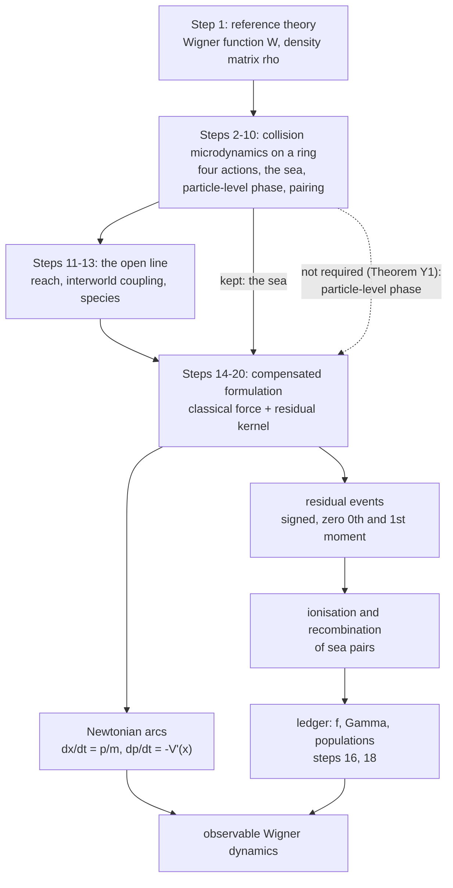

# Orientation

**A conceptual guide to WPMW for a reader arriving with no prior context:
what the project is trying to do, what the one central idea is, which words
mean what, and what is established as against postulated, open, or
retracted.**

---

## 0. Status and provenance

Written 20 September 2026 against the repository at commit `c4443e0`
(ladder steps 1–20, including 11b); revised the same day for continuity.

Prompted by an external summary of the repository produced by a different
language model at Bill Page's request, as a check on whether the project
reads correctly from outside. Most of it did. The places where it did not
are the places this document works hardest, and they are listed in §11 —
they are the errors a careful outside reader is most likely to make, so
they are worth stating as warnings rather than silently correcting.

This document carries **no new results**. Every claim here is sourced to a
note in [`docs/analysis/`](docs/analysis/README.md), and where a claim is
load-bearing the theorem label is given so it can be looked up in
[`docs/analysis/INDEX.md`](docs/analysis/INDEX.md). Where this document and
a note disagree, the note is right.

It is also not a replacement for [`docs/README.md`](docs/README.md), which
says what is in each directory, or for the ladder in
[`docs/analysis/README.md`](docs/analysis/README.md), which is the
step-by-step abstract of the argument. This is the layer below both: the
picture you need in order to read those without misreading them.

---

## 1. What the project is trying to do

Quantum mechanics is normally written as a wave equation. WPMW asks a
narrower question than "is that the right picture": it asks whether the
*same* dynamics can be carried by a population of ordinary point objects
moving on ordinary Newtonian trajectories, provided the population is
allowed to be **signed** — some members counting $`+1`$ and some $`-1`$ —
and provided members can be created and destroyed.

The objects are called **world-particles** or **worlds**. They live in
phase space: each one has a position and a momentum at once, which is the
first thing that distinguishes this from a Bohmian or many-interacting-worlds
picture, where a world carries a position and the momentum is derived from a
field.

The reference theory the construction is tested against is the **Wigner
function** $`W(x,p)`$ and its equation of motion, the quantum Liouville
equation (QLE). Nothing in this project claims to have eliminated the
wavefunction or the density matrix from the mathematics. $`W`$ and
$`\rho`$ are what every result is checked against; the question is whether
a signed particle ensemble can *carry* them, and what that ensemble has to
be like if it can.

The working slogan is:

> **no new force, but new kinematics.**

That slogan is itself a correction — an earlier version said "no new
physics," which [`compensated_ontology.md`](docs/analysis/compensated_ontology.md)
§0 shows was too strong. §5 below says why.

---

## 2. How the repository is organised, and the words it uses

### 2.1 A ladder in three layers

The notes in [`docs/analysis/`](docs/analysis/README.md) form a numbered
**ladder**: each step takes as input something its predecessor postulated,
and each ends with the open items that motivate the next. Later steps
routinely correct earlier ones — each note's §0 says what it retracts — so
the repository read as a single model will look inconsistent. Apart from
the first step, which reviews the source documents, it falls into three
layers, and "step $`n`$" below always means rung $`n`$ of this ladder.

| Steps | Layer | What it does |
|---|---|---|
| 2–10 | Collision microdynamics | Realises the quantum term as local two-body *collision rules* on a periodic position space. Introduces the sea, a particle-level phase, and pairing. |
| 11–13 | The open line | Removes the periodic box, which forces the reach (steps 11, 11b); reads the potential as a coupling between the two ends of a pair (step 12); sorts out what a particle *species* is (step 13). |
| 14–20 | Compensated formulation | The current model: the classical force as deterministic motion, and a residual channel realised by pair creation and destruction. |

Most of this document is about the compensated layer. The collision layer
is context: it is where much of the vocabulary comes from, and §10 says which of its ideas
the current model keeps and which it does not need.

Two terms from the collision layer recur often enough to name now. The
**four actions** — focus, defocus, and left and right hop — are the four
two-body collision rules of step 2, David Cyganski's closed four-action
model. For a potential with a single Fourier mode, step 12 (Theorem I3)
shows these are exactly the four available momentum transfers, so "four
channels" and "four actions" name the same thing. The **ring** is the
periodic position space those steps worked on.

### 2.2 The setting

The construction lives on a discretised phase space, called the
**phase-space crystal** after the model it grew from. Momentum takes values
on a lattice of **rungs** spaced $`\Delta p`$ apart; the notes also call a
momentum value a **row**. A **cell** is an element of the mesh. On the ring
the spacing was set by the ring's circumference; on the open line it is set
by the reach (§6). A **Planck cell** is a phase-space area $`h`$.

### 2.3 The cast

- A **world-particle** (or **world**, or **carrier**) is a point in phase
  space with a sign.
- A **positon** carries $`+1`$ and a **negaton** $`-1`$. (That is their
  meaning in the compensated layer; the words have a second meaning
  elsewhere — §9.3.)
- A **body** is an unpaired positon or negaton: one that contributes to the
  observable.
- A **sea pair** is a co-located positon–negaton pair. It contributes zero
  to the observable and is live in the dynamics.

The **ledger** counts them. Per cell: $`n_+`$ positon bodies, $`n_-`$
negaton bodies, and $`S`$ sea pairs, with $`N = n_+ + n_-`$ the body count.
The observable is $`n_+ - n_-`$; the ledger is everything else (§8).

---

## 3. The one central idea: the compensated split

This is the whole of it, and everything else in the repository is either
what led to it or what it costs.

Write the Wigner equation with the potential term moved to the right:

```math
\partial_t W \;+\; \frac{p}{m}\,\partial_x W \;-\; V'(x)\,\partial_p W
\;=\; \mathcal{R}[W] .
```

The left side is *exactly* classical Liouville transport — streaming plus
the full classical force. The right side, $`\mathcal{R}`$, is whatever is
left over. The claim is that this is not a perturbative split but a clean
one, and that the two halves have genuinely different characters:

- the classical half is realised by letting every world-particle move on a
  Newtonian arc, $`\dot x = p/m`$, $`\dot p = -V'(x)`$ — deterministic,
  continuous, no quantum force anywhere in it;
- the residual half is realised by **events** that change *which* signed
  carriers exist, not how any existing one accelerates.

Where the split comes from is worth seeing, because it is a two-line
calculation and it explains the vocabulary. In the variable $`s`$ conjugate
to momentum, the entire potential term of the QLE is multiplication by

```math
M(x,s) \;=\; \frac{i}{\hbar}\bigl[\,V(x+y) - V(x-y)\,\bigr],
\qquad y = \frac{\hbar s}{2} .
```

So a world at $`x`$ does not consult $`V`$ at a point. It consults the
*difference* of $`V`$ at two places symmetric about $`x`$, separated by
$`2y`$. Here $`y`$ is the off-diagonal coordinate of the density matrix
$`\rho(x+y,\,x-y)`$: the half-separation between its ket and bra
arguments. Expand in $`y`$: the term linear in $`y`$ is exactly
$`-V'(x)\,\partial_p`$, the full classical force. Subtract it. What remains
is the odd part of the cubic Taylor remainder of $`V`$ — Theorems C1 and C2
of [`compensated_liouville_splitting.md`](docs/analysis/compensated_liouville_splitting.md).

**Theorem C3** is the reason the split is worth making. Restricted to a
bounded separation $`|y| \le y_{\max}`$ — the **reach**, the subject of §6
— the residual kernel has zero zeroth *and* first moments. So the residual
channel:

- conserves signed world number;
- carries no net momentum;
- exerts no force;
- contains the entire non-classical content.

Two immediate consequences that a reader should hold onto:

- For a **quadratic** potential the residual is identically zero — measured
  at $`1.2\times10^{-15}`$ at every reach (Theorem G2). The harmonic
  oscillator is exactly classical in this formulation, *and it is still
  quantum*. The residual channel is switched on by the non-linearity of
  $`V`$ in the separation, not by "quantumness."
- For a free particle the potential difference a world consults — step
  12 calls it the **interworld coupling**, $`U = V(x_1) - V(x_2)`$ between
  the two ends $`x_{1,2} = x \pm y`$ — vanishes identically (Proposition
  I1). So free wave-packet spreading is **not** caused by any force one
  world exerts on another. That is the sharpest point of difference from
  many-interacting-worlds models, where an interworld potential is
  precisely what makes a free packet spread. Step 12 also shows (Theorem
  I4) that the part of $`U`$ linear in the separation is *exactly* the
  classical force, which is the fact the split rests on.

---

## 4. What the residual events actually are

The residual kernel is real and odd, hence **signed**, hence not a
one-body Markov jump generator — it cannot be realised as "this particle
hops with this probability" (splitting note §2.2, and Proposition T3 in
[`takabayasi_1954_stochastic_picture.md`](docs/supplement/takabayasi_1954_stochastic_picture.md)).
Something has to supply the negative part.

That something is the **sea**. Write $`K_{\mathrm{res}}(q)`$ for the
residual kernel's signed weight for a momentum transfer of $`q`$ rungs. An
event is generated at a **parent** world in row $`c`$, and its whole effect
on the observable is $`+1`$ at row $`c+q`$ and $`-1`$ at row $`c-q`$. There
are exactly two ways to realise that
([`stochastic_ledger.md`](docs/analysis/stochastic_ledger.md) §1):

- **emissive** — **ionise** a sea pair at the parent's row: its positon
  appears as a body at $`c+q`$ and its negaton at $`c-q`$;
- **absorptive** — remove a negaton body at $`c+q`$ and a positon body at
  $`c-q`$, and a new sea pair appears at the parent's row. The notes call
  this **catalysed recombination**.

Two things about the sea that are easy to get wrong:

1. **It is not optional bookkeeping.** By postulate (S) of §7 the parent
   does not recoil — it stays on its Newtonian arc — so the momentum the two
   daughters carry, $`(c+q) + (c-q) = 2c`$ in rung units, must come from
   something already at row $`c`$: a
   neutral pair at the parent's own row (Proposition K8, Theorem S0). That
   is what makes "ionisation" a derivation rather than a metaphor. And by
   Theorem G4 (§5) the sea's events are what keep the ensemble physically
   admissible. The collision layer reached the same necessity by a
   different route: step 2's no-go lemma shows pairwise collision rates are
   quadratic in occupancy while the Wigner generator is linear, so some
   species' density has to be pinned.
2. **Pairs are split and combined, never made from nothing.** Every event
   and every recombination either splits a sea pair into two bodies or
   combines two bodies into a sea pair; streaming only moves them. So,
   summed over all cells, positon number $`S + n_+`$ and negaton number
   $`S + n_-`$ are each exactly conserved, and so is their mean, the pair
   count $`P = S + N/2`$ — on every trajectory, in exact integers (Theorem
   N1). Step 13's Theorem D15 is the same statement for the four actions.

---

## 5. What compensation does *not* remove

This is the single most important qualification in the project, and the
place where an outside summary is most likely to overclaim.

Removing the classical force from the quantum channel removes **quantum
force**. It does not remove **quantum kinematics**.

The evidence is Theorem G4, and it was not anticipated. Take an admissible
ensemble — one whose expectation is the Wigner function of some
$`\rho \ge 0`$ — and evolve it by Newtonian streaming alone (postulate
(S) of §7) with the residual channel switched off. It leaves the admissible set: the
least eigenvalue of the reconstructed $`\rho`$ falls from the $`10^{-8}`$
grid floor to $`-0.10`$. Turn the residual channel back on and it does not.

So the residual channel is doing **kinematic** work — keeping the ensemble
inside the allowed quantum state space — and not merely supplying a small
correction to observable forces. The sea is load-bearing for the *state
space*, not just for the *dynamics*.

Theorem G3 makes the same point from the other side: the residual generator
and the admissibility constraint are independent functions of $`\hbar`$:
sweeping $`\hbar`$ for a quartic potential closes the first continuously
while the second does not move at all. Proposition G3.1 exhibits four Gaussians the dynamics cannot tell
apart, differing by a factor of eight in phase-space area; the inequality
that separates them is exactly the Wigner bound $`|W| \le 2/h`$.

This is why admissibility is a **separate postulate** (A) and not a
theorem. See §7.

---

## 6. The reach

The reach is the one parameter the whole construction depends on, and it is
also the one most often misdescribed.

**What it is.** The **coherence horizon** $`L_c`$ bounds the ket–bra
separation a world instantiates; the **reach** is the half-separation,
$`y_{\max} = L_c/2`$ (Definitions (H) and (R),
[`open_position_space.md`](docs/analysis/open_position_space.md) §3). It is
a bound in the *separation* coordinate, not a wall in position space — it
is orthogonal to position.

**What it is not.** It is not an aperture through which a world samples
nearby positions. **Theorem E1**: a momentum lattice exists *if and only if*
the difference field $`D_x(y) = V(x+y) - V(x-y)`$ is periodic in $`y`$, with

```math
\Delta p \;=\; \frac{\pi\hbar}{\text{period}} ,
```

and the circumference of the ring (§2.1), the periodicity of $`V`$, and
the postulated horizon are one mechanism with three sources for that period. A window of
finite support does not by itself deliver a lattice. Proposition E1.1
sharpens this: a sharp window is exact when $`2y_{\max}`$ is a whole number
of periods of the potential and fails otherwise — **commensuration**, not
sharpness, is what matters. When the horizon does supply the period,
$`\Delta p = \pi\hbar/(2y_{\max})`$ (Theorem C4), so reach and momentum
quantum are the same parameter seen twice.

**What it controls.** Simultaneously: the greatest pair separation a world
represents; the momentum resolution; the position range over which a world
feels a scatterer (Theorem C7 — if $`V'''`$ vanishes on
$`[x-y_{\max},\,x+y_{\max}]`$, a world at $`x`$ takes no events at all);
and the **event budget** — the total residual event rate
$`\Gamma = \sum_q |K_{\mathrm{res}}(q)|`$.

**Its ceiling is set by the potential.** Theorem K1: the reach ceiling is
the distance to the nearest *complex* singularity of $`V`$. For the Eckart
barrier $`V_0\,\mathrm{sech}^2(r/a)`$ this is the uniform bound
$`y_{\max} < \pi a/2`$. For a soft-core Coulomb potential it is
$`R(x) = \sqrt{x^2 + \varepsilon^2}`$, which *varies with position* — so
either the momentum quantum varies with $`x`$ and the phase-space crystal
is not uniform, or a single uniform lattice must take the infimum
(Theorem Z3). This is open item Z-LS1.

**It is a regulator, and that is a defect, not a feature.** Theorem E8: the
residual event budget grows without bound with the reach for every $`V`$
with $`V'(x) \ne 0`$. Theorem G5: $`\Gamma`$ grows roughly linearly with
the reach while the evolution it produces converges to $`10^{-14}`$. So *how many
worlds exist* is currently a property of the regulator rather than of the
physics. Whether that matters is exactly open item **G-SP1** (split gauge
invariance, §11.3), the load-bearing open question of
[`compensated_ontology.md`](docs/analysis/compensated_ontology.md).

A tutorial written for exactly this confusion is
[`what_the_reach_is.md`](docs/supplement/what_the_reach_is.md). Read it
before reading anything that quotes a reach.

---

## 7. The proposed ontology

Stated as four postulates in
[`compensated_ontology.md`](docs/analysis/compensated_ontology.md):

| | Postulate | Content |
|---|---|---|
| **(E)** | Existence | A world is a signed counting measure on phase space. |
| **(A)** | Admissibility | Only ensembles whose expectation is the Wigner function of some $`\rho \ge 0`$ occur. |
| **(S)** | Streaming | Every world-particle streams on a Newtonian arc under the *full* classical force. Co-located members of a sea pair share a trajectory. |
| **(D)** | Demography | Pairs are ionised from and recombined into the sea at rate $`\Gamma = \sum_q |K_{\mathrm{res}}(q)|`$, a fraction $`f`$ of events realised absorptively (§8). |

(A) is **not** derivable from (S) + (D) — that is Proposition G3.1 and
Theorem G4. It is non-dynamical: it constrains which ensembles occur, not
how they move. Giving it a particle-level statement is open item G-SP2.

---

## 8. The ledger, and why it is invisible

The **observable map** $`\mathcal{E}`$ takes the signed ensemble to
$`W`$, and it sees only the difference of the two body populations,

```math
W \;\propto\; n_+ - n_- ,
```

while the QLE says **nothing at all** about $`n_+ + n_-`$ or about $`S`$. The total
population is extra structure, not readable off the reference theory. This
is why "how big is the sea" is a real question with no answer in the Wigner
equation.

The two realisations of an event from §4 agree in the observable and are
opposite in the ledger: emissive takes $`S \to S-1`$, $`N \to N+2`$;
absorptive takes $`S \to S+1`$, $`N \to N-2`$. Theorem N2: both move the
observable identically, so the choice between
them lies entirely in the kernel of the observable map. The only noise
$`W`$ ever sees is Poisson event-timing noise, common to both branches.

Write $`f`$ for the absorptive fraction. **Theorem N3** is the current law:

```math
\Gamma_{\mathrm{tot}}\,(1 - 2f) \;=\; R_{\mathrm{sink}} ,
```

where $`\Gamma_{\mathrm{tot}}`$ is the total event rate and
$`R_{\mathrm{sink}}`$ the total rate of every *other* channel that removes
bodies — for instance **contact recombination**, a separate channel in
which a coincident positon and negaton body combine into a sea pair at rate
$`\kappa\,n_+n_-`$. So:

- $`f = 1/2`$ is the **sinkless special case**, not a universal law — this
  is an explicit correction to the earlier Theorem S7;
- any sink forces $`f < 1/2`$ by a computable amount, verified to between
  0.01 and 0.9 per cent over a fortyfold range;
- population closure is a dynamical problem in its own right.

Under an independent-occupancy closure $`f(\lambda) = (1-e^{-\lambda})^2`$,
and the sinkless value pins
$`\lambda_* = -\ln(1 - 2^{-1/2}) = 1.227947`$ bodies of each sign per cell
— 2.456 bodies per cell against exactly two sea pairs per Planck cell,
measured 2.4487 against 2.4559 when bodies are spread uniformly (Theorems
N4, N5). Here $`\lambda`$ is the mean number of bodies of one sign in a
cell, and $`f`$ is the probability that an event finds both bodies it needs
to settle absorptively.

**Theorem N6** reassigns a role the project had wrongly given to
recombination: with streaming off, per-cell occupancy is a reflected
critical random walk whose spread grows without bound; turning streaming on
holds it flat. **Streaming, not recombination, is the local regulator** —
and by N3 no sink could have been, since every sink moves $`f`$ off one
half.

---

## 9. The vocabulary, including the trap

### 9.1 Dictionary

| Term | Mathematical role | What it means |
|---|---|---|
| **World / world-particle / carrier** | a signed atom of a counting measure on $`(x,p)`$ | has a position *and* a momentum |
| **Positon / negaton** | sign of the carrier (ensemble E1), or ket/bra leg (ensemble E2) | **two different meanings** — see §9.3 |
| **Body** | an unpaired positon or negaton | contributes to the observable |
| **Leg** | one end of a ket–bra pair, carrying "a place and a clock" | the two positions $`x \pm y`$ are two *branches'* answers to where the one particle is, not two particles |
| **Reach $`y_{\max}`$** | $`y_{\max} = L_c/2`$; period giving $`\Delta p = \pi\hbar/2y_{\max}`$ | greatest half ket–bra separation instantiated |
| **Sea pair** | background neutral pair population | the partner population residual events consume and return |
| **Dark / aligned** | *pair* $`\mu = 0`$ (§9.2) | a *relational* state of a pair, not a species |
| **Residual channel** | compensated odd kernel $`\mathcal{R}`$ | what is left of the QLE after the classical force is removed |
| **Ionisation** | sea pair $`\to`$ two visible daughters | the microscopic realisation of a residual event |
| **Recombination** | two bodies $`\to`$ sea pair | **two channels**, catalysed and contact — see §9.3 |
| **Four actions** | focus, defocus, left hop, right hop | the collision rules of step 2 (§2.1) |
| **Admissibility** | $`\rho \ge 0`$ after reconstruction | the constraint (A) selecting physical ensembles |
| **$`\mathcal{E}`$ (the observable map)** | ensemble $`\to`$ $`W`$ | what is measurable; the ledger lives in its kernel |

### 9.2 The two $`\mu`$ — the trap

There are **two distinct quantities written $`\mu`$** in this repository,
and conflating them produces a picture that looks coherent and is wrong.

| | **Pair $`\mu`$** (step 5) | **Ladder $`\mu`$** (step 9) |
|---|---|---|
| Definition | $`\mu = \Phi_a - \Phi_b \pmod{2\pi}`$, the misalignment of the transported clock phases of a pair's two members $`a`$, $`b`$ | $`\mu = \arg\rho(X,X')`$, the phase of the density matrix between two leg positions $`X`$, $`X'`$ |
| Lives in | the phase-resonance / phase-alignment formulation, steps 4–8 | the position-pair ladder of step 9 — the name refers to that note, not to the ladder of notes |
| Obeys | $`\partial_x\mu = \Delta p/\hbar`$ with $`\Delta p = p_a - p_b`$; along a path of velocity $`v`$, $`d\mu/dt = \Delta p\,(v - \bar v_{\mathrm{pair}})/\hbar`$ | $`\bar p = \hbar\mu/a`$ with $`a`$ the position spacing — momentum *is* the misalignment |
| Conjugate to | — | the separation $`y`$ the compensated kernel integrates over |

[`what_the_reach_is.md`](docs/supplement/what_the_reach_is.md) §1 exists
specifically to keep these apart. If a summary runs
"reach $`\to \Delta p \to \mu`$-winding $`\to`$ dark sea $`\to`$ residual
ionisation" as one chain, it has crossed between the two.

### 9.3 Other collisions

- **Positon** has two meanings, because step 13 separates two ensembles:
  E1 draws carriers from $`W`$, with species the sign of $`W`$ (the meaning
  used in this document); E2 draws them from the density matrix, with
  positon and negaton naming the ket and bra legs of a pair. **Theorem D0**: the Weyl transform relates the represented
  objects but *not* the ensembles — the species censuses are anti-correlated
  and no carrier-level map exists. The word is a homonym across the two
  layers.
- **"Bound pair"**, in notes before step 20, means a sea pair. Step 20
  argues the word is wrong — nothing holds the pair together; the relation
  is alignment — and open item Y-SP8 proposes "aligned" instead. No note has
  been renamed yet.
- **"Recombination"** names two different channels: *catalysed*
  recombination is the absorptive realisation of an event, at the parent's
  row (§4); *contact* recombination is the $`\kappa`$ sink of §8, two
  coincident bodies combining with no parent.
- **"Sea"** describes what a pair is doing in the population dynamics;
  **"dark"** describes its internal phase relation. A dark sea pair is
  both; neither word implies the other.

---

## 10. What the compensated model keeps from the earlier layers

§2.1 described the ladder as layers in sequence. The sequence is real —
each step built on the last — but the compensated model does not inherit
everything the collision layer built, and what it inherits is where outside
readings most often go wrong.



The dotted arrow is the one that matters. **Theorem Y1**: the compensated
kernel is read from the potential directly and is linear in it —
$`K(\lambda V) = \lambda K(V)`$ to machine precision. Step 4's Theorem 2
says an event rule blind to phase cannot be linear in the potential; that
no-go does not reach the compensated kernel *because* the phase it needs
is already integrated into the kernel, as the ladder $`\mu`$ conjugate to
the separation $`y`$ (§9.2). **Corollary Y1.1**: a particle-level phase
can therefore never be *necessary* for the observable $`\mathcal{E}`$; any
phase rule lives in the kernel of the observable map, where the emissive /
absorptive choice already lives.

So the particle-level phase of steps 4–8 is **not an input** to the
compensated model. It remains a source of interpretive vocabulary —
darkness, alignment — and step 20 shows the phase account of darkness does
carry over (Theorems Y3, Y4), but nothing the compensated model computes
depends on it. Summaries that chain the phase layer into the compensated
layer as a dependency are describing a model the repository does not have.

---

## 11. What is established, what is open, and what has been retracted

### 11.1 The strongest positive results

| Result | What it shows |
|---|---|
| **Eckart transmission (K4–K6)** | Newtonian motion alone reproduces the classical transmission exactly, so the *entire* quantum correction to transmission is delivered by the residual channel: 0.044475 measured against a closed-form 0.044134. It arrives as a small imbalance between two large opposed flows of pairs across the classical separatrix — the net flow is 0.19 of the gross. |
| **Quadratic emptiness (G2)** | $`1.2\times10^{-15}`$ at every reach, against $`O(100)`$ for the published signed-particle formulation on the same system, whose event rate carries the classical force too (the *field-less* rate of the ontology note). The sharpest available argument that the compensated split is ontology and not numerics. |
| **Kinematic work (G4)** | Admissibility is preserved by (S)+(D) and not by (S) alone. |
| **Pathwise invariant (N1)** | The pair count $`P = S + N/2`$ (§4) is conserved in exact integers on every trajectory, not merely in expectation. |
| **Transport as regulator (N6)** | Streaming, not recombination, holds the local ledger steady. |

### 11.2 Retracted or corrected — do not repeat these

These were stated in the repository and are no longer the project's
position. [`INDEX.md`](docs/analysis/INDEX.md) §6 is the full ledger; these
are the ones an outside reader is most likely to have picked up.

| Retracted claim | Replaced by |
|---|---|
| "No new physics" | "No new force": (A) is non-dynamical and not derivable from (S)+(D). |
| $`f = 1/2`$ is a universal law (S7) | $`\Gamma_{\mathrm{tot}}(1-2f) = R_{\mathrm{sink}}`$ (N3); $`f = 1/2`$ is the sinkless case. |
| Each world's trajectory can stay continuous through every event | **Theorem Y5**: an event has to change how many positons and negatons sit in some momentum row. If no world is created or destroyed and none changes momentum, nothing changes and the residual channel does nothing. So either worlds jump in momentum at events — piecewise worldlines — or they are born and die. There is no third option. |
| "The diffusion in the phase variables is identically zero" (step 18) | **Theorem Y6**: holds under birth and death. Under piecewise worldlines a *tagged* positon — one individual, followed by label — performs a driftless momentum walk with diffusion $`D_p = \tfrac12\sum_q \xi_q^2\,|K_{\mathrm{res}}(q)|`$, where $`\xi_q`$ is the momentum jump of channel $`q`$: an unsigned moment, which the observable never feels. |
| Tunnelling is a population effect superposed on continuous individual trajectories | **Theorem Y6**: at the Eckart barrier with incident energy half the barrier height, tagged positons cross with probability 0.327, against 0.213 for the observable and 0.069 classically — tracking neither, and falling *below* both above the barrier. Tunnelling survives as a demographic account of $`\mathcal{E}`$ and **not** as a statement about identity. |
| A reach is an aperture; a finite window gives a momentum lattice | **Theorem E1 / Proposition E1.1**: reach is a *period*; commensuration, not sharpness, is what delivers the lattice. |
| An absorbing layer can stop worlds escaping | **Theorem O1**: the Wigner kernel's modulus is independent of position, so no absorber can. The horizon goes on the separation. |

### 11.3 The open questions that matter

The full list, with status and cross-references, is
[`INDEX.md`](docs/analysis/INDEX.md) §7 — currently around sixty items. The
load-bearing few:

- **G-SP1 — split gauge invariance.** Do admissible splits with different
  reach profiles and different allocations between deterministic and
  residual sectors give the same observable dynamics? If they do, the
  number of worlds carries no physical meaning and the regulator dependence
  of G5 is harmless; if they do not, it is a defect in the theory rather
  than in the numerics. This is *the* outstanding theorem.
- **N-SP1 — instrument the sum rule in the mean-field demo of step 16.**
  That demo measures $`f`$ somewhat below one half, by an amount that
  depends on the reach; checking N3 there would say exactly why.
- **Z-LS2 — soft-core Coulomb transmission** against a split-operator
  reference. No closed form exists, so this needs a trusted numerical
  reference; planned next.
- **Z-LS1 — the non-uniform lattice.** Deferred by decision, but it is what
  Theorem Z3 forces if atoms are to be represented at all.
- **Y-SP2 — the creation rule, forced or free.** Is a newly created sea
  pair dark because of where the momentum jump happens (forced), or because
  alignment is imposed as a rule (free)?
- **CLA7 — the reach is over-determined.** Three conditions pull on it at
  the Eckart barrier and do not all fit: the K1 ceiling $`y_{\max} < \pi a/2`$,
  the ledger closing in a usable window only around $`y_{\max} \approx 4\pi a`$
  (Theorem K9), and the need for enough rungs to resolve the packet
  (Corollary K1.1).

### 11.4 Scope

Stated narrowly in [`compensated_ontology.md`](docs/analysis/compensated_ontology.md)
§8: systems of $`N`$ particles carry over verbatim; **spin not at all**; measurement untouched; no
relativistic treatment. Nothing in this repository has been through
external peer review — see [`AI-USE.md`](AI-USE.md) for what "verified"
means here, which is narrower than what it means in a journal.

---

## 12. Where to read next

**If you want to run something.** Go to
[`docs/algorithm/compensated_liouville_algorithm.md`](docs/algorithm/compensated_liouville_algorithm.md)
— the current model's implementable specification — and its demo
`src/demo_compensated_liouville_algorithm.py`. Read §4.4 before quoting any
event budget from anywhere. (The older
`phase_space_crystal_lattice_algorithm.md` specifies the collision-layer
model on the ring, with a single mediated jump rule; it is canonical for what it describes, but it is not
the compensated model.)

**If you want the conceptual thread of the current model**, the short path:

1. [`what_the_reach_is.md`](docs/supplement/what_the_reach_is.md) — tutorial; the geometry, and the two $`\mu`$
2. [`interworld_coupling.md`](docs/analysis/interworld_coupling.md) — the potential as a coupling between the two ends of a pair; why its linear part is exactly the classical force, and why it vanishes for a free particle
3. [`reach_energy_coupling.md`](docs/analysis/reach_energy_coupling.md) — what the reach is and controls
4. [`compensated_liouville_splitting.md`](docs/analysis/compensated_liouville_splitting.md) — the split itself
5. [`eckart_barrier_compensated.md`](docs/analysis/eckart_barrier_compensated.md) — the first real test
6. [`compensated_ontology.md`](docs/analysis/compensated_ontology.md) — the four postulates and what they leave out
7. [`stochastic_ledger.md`](docs/analysis/stochastic_ledger.md) — the population law
8. [`dark_sea_and_worldline_identity.md`](docs/analysis/dark_sea_and_worldline_identity.md) — what it costs in identity

**If you want the whole argument in order**, read the ladder in
[`docs/analysis/README.md`](docs/analysis/README.md) from step 1. Steps
2–10 are the collision layer; per §10 above, they are context for the
compensated model rather than input to it.

**If you have a label** — Theorem K4, open item S-SP3, postulate (A) —
look it up in [`docs/analysis/INDEX.md`](docs/analysis/INDEX.md), which
carries every labelled result with a one-line statement and its *standing*:
whether a later note corrected, restricted, superseded or retracted it.

**If you want the source material**, the project's inputs are David
Cyganski's memos and slide decks (redrafted in
[`docs/supplement/`](docs/supplement/README.md)), Holland's *The Quantum
Theory of Motion*, and Takabayasi (1954); the reading notes on each are in
the supplement folder and the citations in
[`references/bibliography.md`](references/bibliography.md).

---

## 13. One paragraph, if you read nothing else

A quantum state is carried by a signed population of point objects in phase
space. Every one of them moves on an ordinary Newtonian arc under the
ordinary classical force — there is no quantum force acting on any of them.
The non-classical part of the dynamics appears instead as births and deaths:
local ionisation and recombination of neutral pairs drawn from a background
sea, at a rate fixed by how far a world can see into the potential. For a
quadratic potential that channel is empty and the theory is still quantum,
which shows that creation and annihilation are not the whole story; the rest
is carried by a separate, non-dynamical admissibility constraint that the
births and deaths are needed to preserve. The account is a statement about
the signed *population* and what it computes, not about the identity of any
individual carrier — the individuals, when you tag and follow them, do
something else.
