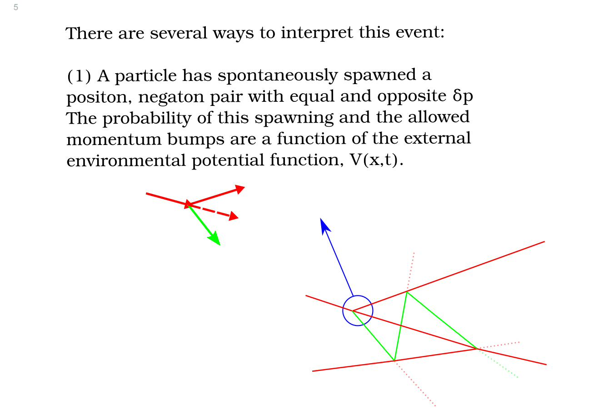
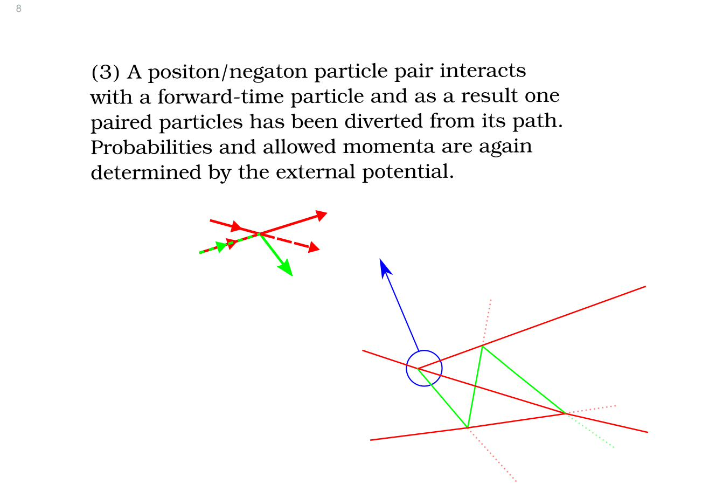
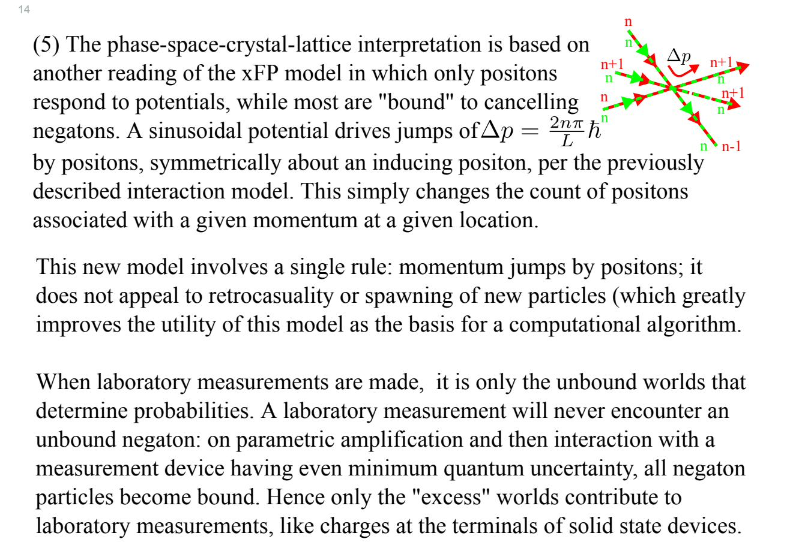

# Phase-Space Crystal-Lattice Model and Stochastic Microdynamics

> **Provenance.** The analytical content of this document is a redrafted and restructured version of the project memo *Extended Fokker–Planck Eq. and the QLE V2*, authored by **David Cyganski**. The figures in §3 and §4 are reproduced from his companion slide deck *Wigner Collisions Diagram* (Sozi presentation). The narrative emphasis here is the crystal-lattice particle model and its stochastic microdynamics, rather than the full kinetic-theory hierarchy of the original. One sign correction is applied; see §6.3.

---

## 1. Scope

The original V2 memo set out to:

1. Place the Wigner Quantum Liouville Equation (QLE) in the hierarchy of kinetic equations.
2. Re-derive Wiedemann's beam-physics Fokker–Planck construction at higher Taylor-expansion order, producing what Cyganski calls the *extended Fokker–Planck (xFP)* equation.
3. Match xFP term-by-term to the Moyal series expansion of the QLE.
4. Use that match to specify a stochastic microdynamics — discrete momentum jumps mediated by the local potential — that evolves a Wigner distribution without explicit positon/negaton spawning.

This redraft retains points (3) and (4) and treats (1)–(2) only briefly (see Cyganski's original V2 memo for the full hierarchical discussion).

---

## 2. Setup: Wiedemann's continuity argument, taken to third order

Wiedemann (*Particle Accelerator Physics*, ch. 12) considers a 1+1-D phase-space density $\Psi(w, p_w, t)$ with deterministic-plus-stochastic dynamics

$$\dot{w} = f_w(w, p_w, t) + \sum_i \xi_i\thinspace\delta(t - t_i), \qquad \dot{p}_w = g_w(w, p_w, t) + \sum_i \pi_i\thinspace\delta(t - t_i)$$

where $\xi_i$ and $\pi_i$ are jump amplitudes whose probability densities $P_w(\xi)$ and $P_p(\pi)$ are normalised and centred. Probability mass conservation in the differential phase-space rectangle gives

$$\Psi(w + f_w \Delta t,\ p_w + g_w \Delta t,\ t + \Delta t)\thinspace\Delta A_Q = \Psi(w, p_w, t)\thinspace\Delta A_P$$

with the post-advection volume distortion factor

$$\Delta A_Q = \Delta w\thinspace\Delta p_w\bigl[1 + (\partial_w f_w + \partial_{p_w} g_w)\Delta t\bigr]$$

The post-jump density is obtained by convolving with the jump statistics:

$$I = \Delta A_P \iint \Psi(w - \xi, p_w - \zeta, t)\thinspace P_w(\xi)\thinspace P_p(\zeta)\thinspace d\xi\thinspace d\zeta$$

Wiedemann expands $\Psi(w-\xi, p_w-\zeta, t)$ to second order in $\xi, \zeta$, recovering the standard Fokker–Planck equation. Cyganski extends the expansion to **third order**:

$$\Psi(w-\xi, p_w-\zeta, t) \approx \Psi - \xi \partial_w \Psi - \zeta \partial_{p_w}\Psi + \tfrac{1}{2}\xi^2 \partial_w^2\Psi + \xi\zeta \partial_w\partial_{p_w}\Psi + \tfrac{1}{2}\zeta^2 \partial_{p_w}^2\Psi - \tfrac{1}{6}\xi^3 \partial_w^3\Psi - \cdots - \tfrac{1}{6}\zeta^3 \partial_{p_w}^3\Psi$$

Following Wiedemann's procedure but adopting **rate-based** rather than per-event jump statistics (see Cyganski's annotations on Wiedemann §12.3 — Wiedemann's "every particle jumps" reading is repaired by introducing rates $\eta_\xi, \eta_\zeta$), and renaming $w \to x$ and $\Psi \to W$ for use as the Wigner distribution, the result is the **extended Fokker–Planck (xFP) equation**:

$$\partial_t W + f\thinspace\partial_x W + g\thinspace\partial_p W  \; = \;  -W\bigl(\partial_x f + \partial_p g\bigr) + \tfrac{\eta_\xi}{2}\langle \xi^2\rangle\partial_x^2 W + \tfrac{\eta_\zeta}{2}\langle \zeta^2\rangle\partial_p^2 W - \tfrac{\eta_\xi}{6}\langle \xi^3\rangle\partial_x^3 W - \tfrac{\eta_\zeta}{6}\langle \zeta^3\rangle\partial_p^3 W$$

---

## 3. Matching xFP to the Moyal series of the QLE

The QLE in 1+1D is

$$\partial_t W + \frac{p}{m}\thinspace\partial_x W  \; - \;  \frac{\partial V}{\partial x}\thinspace\frac{\partial W}{\partial p}  \; + \;  \frac{\hbar^2}{24}\frac{\partial^3 V}{\partial x^3}\frac{\partial^3 W}{\partial p^3}  \; - \;  \cdots  \; = \;  0$$

Matching this term by term to the xFP equation gives:

| xFP term | QLE counterpart | Required identification |
|---|---|---|
| $f\thinspace\partial_x W$ | $(p/m)\thinspace\partial_x W$ | $f(x,p,t) = p/m$ |
| $g\thinspace\partial_p W$ | $-\thinspace V'(x)\thinspace\partial_p W$ | $g(x,p,t) = -\thinspace\partial V/\partial x$ |
| $\langle\xi^k\rangle\thinspace\partial_x^k W$ | (none) | $\xi$ has no nonzero moments (set $\xi \equiv 0$) |
| $\tfrac{\eta_\zeta}{2}\langle\zeta^2\rangle\thinspace\partial_p^2 W$ | (none) | $\langle\zeta^2\rangle = 0$ |
| $-\tfrac{\eta_\zeta}{6}\langle\zeta^3\rangle\thinspace\partial_p^3 W$ | $+\tfrac{\hbar^2}{24}V'''\thinspace\partial_p^3 W$ | $\eta_\zeta\langle\zeta^3\rangle = -\tfrac{\hbar^2}{4}\thinspace\partial_x^3 V$ |

Together with the remaining higher odd moments, this is the chain of moment conditions that the jump density $P_\zeta(\zeta)$ must satisfy.

> **Note (sign of $g$).** Cyganski's V2 memo writes "$g = +\partial V/\partial x$" at this matching step. From Hamilton's equation $\dot p = -V'$ and the structure $\dot p_w = g_w$ in (12.87), the correct identification is $g = -V'$. The same correction is implicit in the (correct) general jump formula on V2 page 18 (§6 below), so this is a transcription slip rather than a propagated downstream error in *that* particular derivation. We use $g = -V'$ throughout.

The match imposes a strong constraint: the variance of $\zeta$ must vanish while the third moment is nonzero. **No non-negative probability density satisfies this.** Either $P_\zeta$ is a *quasi-density* (signed; odd about $\zeta = 0$ is sufficient), or $\zeta$ takes values on the imaginary axis. Cyganski takes the quasi-density route, which leads directly to the signed-particle picture.

---

## 4. Trajectory interpretations of the jump events

Cyganski's slide deck gives five interpretations of a single Wigner momentum-jump event. They are all equivalent at the level of the QLE, but they suggest very different particle-level simulations.

### 4.1 Spontaneous spawning

A particle spontaneously emits a positon/negaton pair (red and green respectively, in the figures), with equal-and-opposite $\delta p$. The probability of spawning and the magnitudes of the bumps are set by the local potential $V(x,t)$.



> **A clarification on momentum conservation.** The original slide caption reads *"Energy and momentum are not conserved: spawning only accompanies potential gradients."* Bare-particle momentum is indeed not conserved, but the *missing* momentum is supplied by a quantum of the potential field — a "photon" of momentum $h/L$ at the wavelength of the relevant Fourier mode (§5). The total momentum, including the field, **is** conserved. We have softened this caption accordingly.

### 4.2 Pair diversion

A pre-existing positon/negaton pair encounters a forward-time particle; one of the paired particles is diverted. This is the picture that arises most directly from the xFP equation:



### 4.3 Retrocausal-edit

A negaton from the future propagates backwards in time, interacts with a forward-time particle, and is reflected forward — appearing in real time as an unexplained discontinuous momentum change of the forward-time particle. This is mathematically equivalent to (4.1) and (4.2), but the particle bookkeeping is over time-reversing trajectories rather than instantaneous spawning.

### 4.4 Phase-space crystal-lattice (the operationally useful one)

A static background "crystal" of paired positon–negaton pairs fills phase space. Only positons jump in response to the potential; the negaton background never updates dynamically. Laboratory measurements probe only the *excess* positon population above the background. **This is the interpretation the algorithm in `docs/algorithm/` implements.**

Justification (slide 15): every term in the QLE Moyal series contains a derivative of $W$, so the QLE is invariant under $W \to W + W_0$ for any constant $W_0$. Since any physical Wigner distribution is bounded by $|W| \le 2/h$, choosing $W_0 = 2/h$ gives an equivalent admissible distribution that is everywhere non-negative — no negatons ever need to be propagated.



---

## 5. The Fourier-mode jump quantum: $\Delta p = h/L$

For a sinusoidal potential of period $L/n$,

$$V(x) = V_p \cos\negthinspace\left(\frac{2\pi n x}{L} + \phi\right)$$

each spawning/jump event imparts to the two participating particles equal and opposite momentum kicks of magnitude $n\pi\hbar/L$, for a total spread of

$$\Delta p  \; = \;  \frac{2 n \pi \hbar}{L}  \; = \;  \frac{n h}{L}$$

This is precisely Abraham's kinetic momentum for a photon of wavelength $L/n$, as Cyganski derives by examining the negaton in its comoving frame (slide 11, reproduced below).


This is the energetic justification for the discrete momentum-cell spacing $\Delta p = \pi\hbar/L$ adopted in the crystal-lattice algorithm: at this resolution, mode $q$ drives a jump of *exactly $q$ momentum cells* per particle.

---

## 6. The discrete update rule for sinusoidal potentials

### 6.1 Direct derivation from the QLE

For $V(x) = V_p \cos\theta$ with $\theta(x) \equiv 2\pi q x/L + \phi$,

$$V'(x)  \; = \;  -\thinspace V_p\thinspace\frac{2\pi q}{L}\thinspace\sin\theta$$

The QLE force-term contribution to $\partial_t W$ is

$$\partial_t W  \; \supset \;  +\thinspace V'(x)\thinspace\partial_p W$$

(from $\dot p = -V'$ feeding into the Liouville flow $\partial_t W + \dot p\thinspace\partial_p W = 0$). Approximating $\partial_p W$ by a centred finite difference at the photon-momentum scale $\Delta p_q = q\pi\hbar/L$,

$$\partial_p W \approx \frac{W(x,\thinspace p + \Delta p_q) - W(x,\thinspace p - \Delta p_q)}{2\thinspace\Delta p_q}  \; = \;  \frac{L}{q\thinspace h}\bigl[W_{\rm hi} - W_{\rm lo}\bigr]$$

and combining,

$$\boxed{ \; \frac{\Delta W}{\Delta t}  \; = \;  -\thinspace\frac{V_p}{\hbar}\thinspace\sin\theta\thinspace\bigl[W_{\rm hi} - W_{\rm lo}\bigr] \; }$$

Equivalently, since $-\sin\theta = \cos(\theta + \pi/2)$,

$$\frac{\Delta W}{\Delta t}  \; = \;  \frac{V_p}{\hbar}\thinspace\cos\negthinspace\left(\theta + \tfrac{\pi}{2}\right)\bigl[W_{\rm hi} - W_{\rm lo}\bigr]$$

This is the **general jump formula** of V2 page 18.

### 6.2 Specialised to a pure cosine ($\phi = 0$, $q = 1$, amplitude $V_{\max}$)

$$W(x,\thinspace p,\thinspace t + dt)  \; = \;  W(x,\thinspace p)  \; - \;  \frac{dt\thinspace V_{\max}}{\hbar}\thinspace\sin\negthinspace\left(\frac{2\pi x}{L}\right)\bigl[W(p + \tfrac{\pi\hbar}{L}) - W(p - \tfrac{\pi\hbar}{L})\bigr]$$

In Python, with the convention that axis 0 is the momentum axis and `np.roll(W, +1, axis=0)` brings $W(p - \Delta p)$ to position $p$ (and similarly `np.roll(W, -1, ..)` brings $W(p + \Delta p)$),

```python
W += (V_max / hbar) * dt * np.sin(2 * np.pi * X / L) * (
        np.roll(W, +1, axis=0) - np.roll(W, -1, axis=0))
```

### 6.3 Sign-error correction relative to V2 page 18

Cyganski's V2 memo writes the simplified-form line on page 18 as

$$W(x,p,t+dt) = W(x,p)  \; {-} \;  \tfrac{dt\thinspace V_{\max}}{\hbar}\thinspace W(p - \tfrac{\pi\hbar}{L})\thinspace\sin\negthinspace\left(\tfrac{2\pi x}{L}\right)  \; {+} \;  \tfrac{dt\thinspace V_{\max}}{\hbar}\thinspace W(p + \tfrac{\pi\hbar}{L})\thinspace\sin\negthinspace\left(\tfrac{2\pi x}{L}\right)$$

— equivalent to

$$\Delta W  \; = \;  +\thinspace\tfrac{dt\thinspace V_{\max}}{\hbar}\thinspace\sin\negthinspace\left(\tfrac{2\pi x}{L}\right)\bigl[W_{\rm hi} - W_{\rm lo}\bigr]$$

This is **the wrong sign** relative to §6.1 above. The error occurs in the algebraic step from the (correct) general formula via $\cos(\theta + \pi/2) = -\sin\theta$: the simplified form drops the leading minus sign. The Python in the same memo,

```python
W += (np.roll(W, -1, axis=0) - np.roll(W, +1, axis=0)) * np.sin(np.pi*X/X_amplitude) * dt * sheight
```

inherits the simplified form and is wrong by the same sign. The corrected Python is

```python
W += (np.roll(W, +1, axis=0) - np.roll(W, -1, axis=0)) * np.sin(np.pi*X/X_amplitude) * dt * sheight
```

(or equivalently, flip the sign of `dt * sheight`).

The error is detectable only with **non-rotationally-symmetric** initial states. Because every Gaussian eigenstate of the harmonic oscillator is invariant under joint reflection in $x$ and $p$, and because the sign error reverses both, it is invisible there. For a coherent state placed off-axis, however, the wrong sign drives the centroid *towards* a potential hill instead of away from it — a textbook diagnostic. The regression test `src/sign_convention_check.py` verifies this. The corrected version of the algorithm is what is implemented in `docs/algorithm/phase_space_crystal_lattice_algorithm.md` and `src/wpmwlib/phase_space_crystal_lattice.py`.

---

## 7. The crystal-lattice algorithm in one paragraph

Discretise phase space with $\Delta p = \pi\hbar/L$. Represent the shifted distribution $W' = W + 2/h$ as integer per-cell positon counts $N_+$. Each timestep:

1. **Free-stream**: shift row $n$ by $\mathrm{round}(p_n\thinspace\Delta t / m\thinspace\Delta x)$ position cells.
2. **Mediated jumps**: for each Fourier mode $q$ of the potential, each positon at $(x_m, p_n)$ acts (with probability $|\Gamma_q(x_m)|\thinspace\Delta t$) as a mediator that transfers one positon between $(x_m, p_{n-q})$ and $(x_m, p_{n+q})$, in the direction set by the sign of $\Gamma_q(x_m) = -\thinspace(V_q/\hbar)\sin(2\pi q x_m/L + \phi_q)$.

No particles are created or destroyed; the negaton background is bookkeeping. Laboratory observables come from the *excess* population $W = N_+ /(\nu\thinspace\Delta x\thinspace\Delta p) - 2/h$.

---

## 8. Limitations and open work

- **Quasi-density requirement.** As noted in §3, matching xFP to the QLE requires a signed (or imaginary-supported) $\zeta$. The single-sign positon model recovers this in expectation through the rule that $\Gamma_q$ can be of either sign, but the underlying microdynamics is therefore not a classical Markov process in the usual sense.
- **General potentials.** For polynomial potentials the moment problem for $P_\zeta$ has impulsive (Dirac-delta-derivative) solutions, unsuitable for direct Monte-Carlo. Bounded smooth potentials behave well. Unbounded potentials must be either soft-confined (multiplied by a smooth cutoff $\chi(x)$) or handled via the QLE differential form directly on the discretised grid.
- **Higher Moyal terms for non-quadratic $V$.** For $V$ beyond quadratic, the third- and higher-order Moyal terms are nonzero and must be included; the Fourier-mode structure of the rule recovers them automatically as higher-order Taylor terms of each $\sin\theta$ contribution.

For the full hierarchical kinetic-theory discussion (BBGKY, Boltzmann, Vlasov, the Perepelkin reinterpretation) and the connection to Smolin/Jaynes/Kac/Ord/McKeon on stochastic substrates and time-reversal interpretations, see the original V2 memo.

---

## Sources

- David Cyganski, *Extended Fokker–Planck Eq. and the QLE V2* (project memo).
- David Cyganski, *Wigner Collisions Diagram* (Sozi presentation; figures in §4 and §5).
- H. Wiedemann, *Particle Accelerator Physics*, 4th ed., Springer, 2015. Eqs. 12.86–12.98.
- W. C. Kerr & A. J. Graham, "Generalized phase space version of Langevin equations and associated Fokker–Planck equations".
- D. G. C. McKeon & G. N. Ord, *Phys. Rev. Lett.* **69**, 3 (1992).
- M. D. Reid & P. D. Drummond, "Objective QFT" (parametric-amplification framework).

The companion review document at `docs/analysis/phase_space_crystal_lattice_review.md` cross-references the V2 memo at the equation-and-page level.
